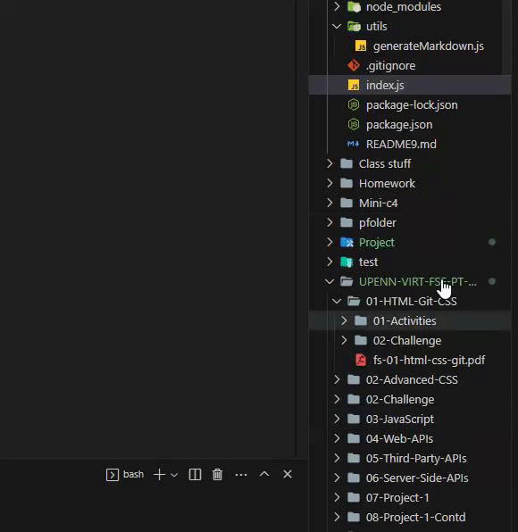

# README Generator: Node.js and JavaScript

## Description

Every professionally built page/app needs an introduction and an overview of their application. I created a README generator that will allow its user to produce a clean and thorough README for anyone's application.

(https://opensource.org/licenses/MIT)

## Table of Contents

- [Installation](#installation)
- [Usage](#usage)
- [Credits](#credits)
- [License](#license)
- [Features](#features)

## Installation

To start using this application, users must first git clone this repository and ensure Node.js is installed on their system.

## Usage

To use this application, follow the steps below:

1. Right-click on `index.js` in your VS Code editor and open up the integrated terminal.

- 
2. Run the command `node index.js` in the terminal to start the application.
- .gif>)
3. Follow the prompt questions in the terminal to generate your README file. The generated README file will be saved in the current directory.
- .gif>)

## Credits

A special thanks to Node.Js which allowed this application to happen.  

## License

- This project is licensed under the MIT license.

## Questions

For questions, please reach out to me at [Albyhua](https://github.com/Albyhua) or [Albyhua@gmail.com](mailto:Albyhua@gmail.com).

